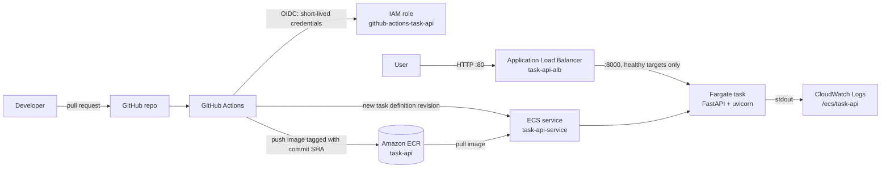

# Fast-cicd — Task API with CI/CD to AWS

A small task-management REST API built with FastAPI, packaged with Docker, and shipped through
GitHub Actions to Amazon ECR and Amazon ECS on Fargate. Every merge to `main` is linted, tested,
built, pushed, scanned and deployed automatically, with no manual steps.

**Live API:** <http://task-api-alb-2120693686.us-east-1.elb.amazonaws.com/docs>

## Architecture



There are two paths:

- **Delivery path:** GitHub Actions authenticates to AWS through OpenID Connect (no stored
  AWS keys), pushes an image tagged with the commit SHA to ECR, and tells ECS to roll it out.
- **Request path:** users reach the Application Load Balancer, which forwards only to tasks that
  pass the `/health` check.

The two meet only at the ECS service, which pulls the new image and replaces tasks one by one
behind the load balancer.

| Component | Choice |
|---|---|
| API | FastAPI + Pydantic v2 (validation, OpenAPI docs at `/docs`) |
| Tests and lint | pytest with FastAPI `TestClient`, Ruff |
| Container | Multi-stage `python:3.12-slim` image, runs as a non-root user |
| CI/CD | GitHub Actions |
| Registry | Amazon ECR (immutable tags, scan on push) |
| Runtime | Amazon ECS on Fargate behind an Application Load Balancer, region `us-east-1` |
| Logs | Amazon CloudWatch Logs |
| AWS auth | GitHub OIDC + IAM role (no long-lived keys) |

## API

| Method | Path | Purpose | Success |
|---|---|---|---|
| GET | `/health` | Liveness check; returns the deployed commit SHA as `version` | 200 |
| GET | `/tasks` | List tasks, optional `?completed=true/false` | 200 |
| POST | `/tasks` | Create a task | 201 |
| GET | `/tasks/{task_id}` | Get one task | 200 |
| PUT | `/tasks/{task_id}` | Update a task (partial fields allowed) | 200 |
| DELETE | `/tasks/{task_id}` | Delete a task | 204 |

All errors share one JSON shape:

| Situation | Status | Body |
|---|---|---|
| Invalid input (missing/blank title, bad priority, unknown field, empty update) | 422 | `{"error": "validation_error", "detail": [{"field", "message"}]}` |
| Task not found | 404 | `{"error": "not_found", "detail": "Task ... not found"}` |
| Unexpected error | 500 | `{"error": "internal_error", ...}`, with the stack trace in the logs |

Storage is in memory, so data resets when a task restarts or a new version deploys. The
`TaskRepository` class keeps storage separate from the routes, so it can be swapped for DynamoDB
or RDS without changing the API.

## Run locally

Requires Python 3.12 (3.14 is not supported by the pinned dependencies) and Docker Desktop.

```bash
python3.12 -m venv .venv
source .venv/bin/activate
pip install -r requirements-dev.txt

ruff check .
pytest                                  # 18 tests

uvicorn app.main:app --reload --port 8000
```

Open <http://localhost:8000/docs>.

With Docker:

```bash
docker compose up --build -d
curl http://localhost:8000/health       # {"status":"ok","version":"local"}
docker compose down
```

## CI/CD pipeline

Defined in [`.github/workflows/ci-cd.yml`](.github/workflows/ci-cd.yml).

| Job | Runs on | What it does |
|---|---|---|
| Lint and test | every pull request and push | `ruff check`, `pytest` (report uploaded as an artifact) |
| Build Docker image | pull requests | Builds the image and checks that `/health` responds inside the container |
| Build and push to ECR | pushes to `main` | Builds for `linux/amd64` and pushes `task-api:<commit SHA>` |
| Deploy to ECS Fargate | after the push job | Registers a new task definition revision from [`.aws/task-definition.json`](.aws/task-definition.json), updates the service, waits for it to be stable, then checks that live `/health` returns the new SHA |

`main` is protected: changes must come through a pull request, and **Lint and test** and
**Build Docker image** must pass before merging. A broken test therefore never reaches AWS; the
build job is skipped and the pull request shows a red check.

### Deploying

1. Create a branch, commit, and open a pull request to `main`.
2. Wait for the two checks to go green, then merge.
3. The merge triggers the push and deploy jobs (about 5 minutes).
4. Confirm with `curl <live URL>/health`; `version` equals the merge commit SHA.

### Rolling back

- **Automatic:** the ECS deployment circuit breaker rolls back if new tasks keep failing health
  checks.
- **Manual:** ECS → `task-api-cluster` → `task-api-service` → Update service → pick an earlier
  task definition revision → Update. Or revert the commit on `main` through a pull request.

## AWS resources

All in account `565962259190`, region `us-east-1`.

| Resource | Name |
|---|---|
| ECR repository | `task-api` (immutable tags, basic scan on push) |
| IAM role for GitHub Actions | `github-actions-task-api` (OIDC trust, inline policy `task-api-deploy`) |
| Task execution role | `ecsTaskExecutionRole` |
| ECS cluster / service | `task-api-cluster` / `task-api-service` (Fargate, 1 task, 0.25 vCPU / 0.5 GB) |
| Load balancer | `task-api-alb`, listener HTTP:80 → target group `task-api-tg` (port 8000, health check `/health`) |
| Security groups | `task-api-alb-sg` (80 from the internet), `task-api-svc-sg` (8000 from the load balancer only) |
| Log group | `/ecs/task-api` |

GitHub repository variables: `AWS_REGION`, `AWS_ROLE_ARN`, `ECR_REPOSITORY`, `ECS_CLUSTER`,
`ECS_SERVICE`, `CONTAINER_NAME`, `API_URL`.

## Security

- **No AWS keys in GitHub.** Actions gets short-lived credentials through OIDC. The role trusts
  only this repository's `main` branch and its `production` environment, using GitHub's immutable
  subject format (`repo:sheharzad-developer@20766744/Fast-cicd@1399558669:...`), so a renamed or
  re-created repository cannot assume it.
- **Least-privilege role:** push to one ECR repository, register task definitions, update the
  service, and pass only `ecsTaskExecutionRole`.
- **Non-root container**, slim base image with Debian security updates applied at build time.
- **Image scanning:** every pushed image is scanned. The current image has 0 Critical findings;
  the remaining 2 High findings (`gcc-14`, `zlib`) have no Debian fix yet and will be picked up
  automatically by a later build.
- **Network:** containers accept traffic on port 8000 only from the load balancer.

## Troubleshooting

| Symptom | Cause | Fix |
|---|---|---|
| `Could not assume role with OIDC: Not authorized to perform sts:AssumeRoleWithWebIdentity` | The role's trust policy `sub` doesn't match the token. This repo uses GitHub's immutable subject format with numeric IDs. | Check the format with `gh api repos/<owner>/<repo>/actions/oidc/customization/sub` and put that exact prefix in the trust policy |
| ECR shows no vulnerability scan for a new image | `docker/build-push-action` adds a provenance attestation, so ECR stores an image index, which basic scanning skips | `provenance: false` in the push job |
| Load balancer targets unhealthy, tasks keep restarting | Wrong container port or health-check path, or the service security group doesn't allow the load balancer | Target group: port 8000, path `/health`; `task-api-svc-sg` must allow 8000 from `task-api-alb-sg` |
| `curl localhost:8000` fails but the container is running | uvicorn bound to `127.0.0.1` | Keep `--host 0.0.0.0` in the Dockerfile `CMD` |
| `ModuleNotFoundError: No module named 'app'` in pytest | Project root not on the import path | `pythonpath = ["."]` under `[tool.pytest.ini_options]` in `pyproject.toml` |
| `pip install` fails building `pydantic-core` | Python 3.14 isn't supported by the pinned versions | Use Python 3.12 |
| Push to `main` rejected | Branch rule requires a pull request | Open a pull request and merge after checks pass |
| Task stops with `exec format error` | Image built for ARM on an Apple Silicon Mac | Let the pipeline build it (`platforms: linux/amd64`) |
| Data disappears after a deploy | Storage is in memory, per task | Expected; move to DynamoDB or RDS for persistence |

Where to look: ECS → service → **Events** tab (why a deploy is stuck), **Logs** tab or CloudWatch
`/ecs/task-api` (application logs), EC2 → Target Groups → `task-api-tg` → **Targets** (load
balancer health).

## Next steps for production

- HTTPS: certificate from AWS Certificate Manager and an HTTPS:443 listener.
- Private subnets with a NAT gateway or VPC endpoints instead of public IPs on tasks.
- Persistent storage (DynamoDB or RDS).
- Required reviewers on the `production` environment for a manual approval gate.
- Two or more tasks across availability zones, with auto scaling.
